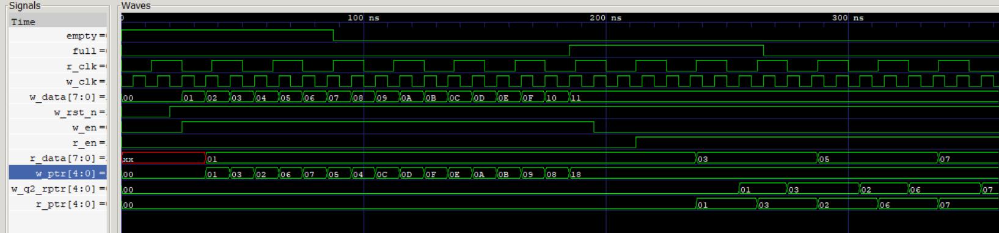

## Asynchronous FIFO Design in Verilog

### High-Performance Clock Domain Crossing (CDC) Memory Controller

📌 **Project Overview**
In modern SoC design, different components (like a high-speed CPU and a lower-speed peripheral) often operate on independent, asynchronous clocks. Directly passing data between them causes metastability and data corruption.

This project implements a Dual-Clock Asynchronous FIFO that serves as a high-reliability bridge. It ensures that data written by a Producer in one clock domain is safely and accurately consumed by a Consumer in another.

🛠️ **Key Technical Features**
* Dual-Port Memory Array: Efficient storage allowing simultaneous read and write operations.
* 2-Stage Synchronizers: A "double-flop" architecture used on both pointer paths to mitigate metastability.
* Gray Code Pointer Conversion: Prevents multi-bit transition errors during clock domain crossing—only one bit changes per clock cycle.
* Mirror-Image Full Detection: A sophisticated Gray-code comparison logic ({~w_q2_rptr[4:3], w_q2_rptr[2:0]}) that accurately detects  "Full" states across lap boundaries.
* Parameterized Design: Easily adjustable DATA_WIDTH and ADDR_WIDTH for different hardware requirements.

🚀 **How the Logic Works**
1. Write Side: The Write Pointer (Binary) tracks the next empty slot. It is converted to Gray Code before being sent to the Read side.
2. The Bridge: The Gray pointer passes through a Synchronizer (the "Airlock"), taking 2 clock cycles to stabilize in the new domain.
3. Read Side: Compares its local pointer with the synchronized write pointer. If they match exactly, it asserts the Empty flag.

Feedback: The Read Pointer is Gray-coded and sent back to the Write side. If it matches the "mirrored" Write Pointer, it asserts the Full flag to prevent overflow.

📊 **Simulation & Verification**
The design was verified using Icarus Verilog and GTKWave.

**Functional Waveform Analysis**

Observations from the Simulation:

- Overflow Protection: The full flag correctly asserts when the FIFO reaches capacity (16 slots), halting the write process.

- Synchronization Latency: You can observe a 2-3 cycle delay between a pointer updating in its home domain and appearing in the opposite domain—this is the expected behavior of the 2-stage synchronizers.

- Data Integrity: Every byte written is read out in the exact same sequence (FIFO principle) with no corrupted data at the clock boundaries.

📂 **File Structure**
* async_fifo.v: Top-level module connecting all components.

* fifo_mem.v: Dual-port RAM storage.

* cdc_sync.v: 2-stage flip-flop synchronizer.

* w_ptr_full.v: Write pointer management and full-flag logic.

* r_ptr_empty.v: Read pointer management and empty-flag logic.

* async_fifo_tb.v: Comprehensive testbench with asynchronous clock generation.

⚙️ **How to Run**
```
# 1. Compile all Verilog files
iverilog -o fifo_sim *.v 

# 2. Run the simulation to generate the VCD file
vvp fifo_sim

# 3. Open GTKWave to view the results
gtkwave fifo_waves.vcd

```
